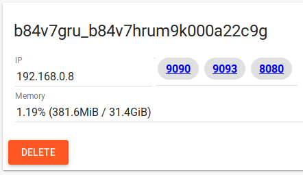

## OpenFaaS Einleitung
OpenFaaS - was ist das überhaupt? OpenFaaS ist ein Open Source Framework für Serverless Functions basierend auf Docker. Docker wird verwendet, um die Funktionen zu "verpacken". Dadurch können die Funktionen in jeder Programmiersprache geschrieben und plattformunabhängig ausgeführt werden. Für OpenFaaS ist es damit egal ob die Funktion in Java, Python oder Prolog geschrieben wurde.

Warum sind Serverless Functions und OpenFaaS interessant? Es lassen sich einfach Services erstellen in jeder Programmiersprache und Framework, die sich beliebig miteinander koppeln lassen. Durch das auschließliche Ausführen der Funktionen, wenn sie aufgerufen werden lassen sich Resource und Kosten sparen, da Server nicht dauerhaft im Hintergrund laufen. OpenFaaS ist Open Source und somit gibt es keine Abhängigkeiten von Providern wie Amazon, Google, Microsoft oder anderen Anbietern. Im Gegenzug muss das Managment von dem OpenFaaS Service übernommen werden.

### Wichtige Begriffe:
- Functions as a Service
- Backend
- API
- Docker
- DevOps

## Aufgabe 1: Setup
Als erster Schritt muss eine OpenFaaS Instanz gestartet werden. Dafür gibt es entweder die Möglichkeit das Setup lokal einzurichten oder einen exteren Service wie [play-with-docker.com](https://labs.play-with-docker.com) kurz PWD zum Testen zu verwenden.

### Play with Docker
Damit Play with Docker verwendet werden kann wird ein Account für [hub.docker.com](https://hub.docker.com/) benötigt. Anschließend kann dieser Account verwendet werden, um sich auf [play-with-docker.com](https://labs.play-with-docker.com) anzumelden. Nach einer erfolgreichen Anmeldung wird auf eine Seite weitergeleitet, auf der Server Instanzen erstellt werden können. Die neu erstellte Instanz lässt sich über ein Webterminal kontrollieren.


### Eigener Rechner
Es ist ebenfalls möglich das Tutorial auf dem eigenen Rechner durchzuführen. Dafür gibt es jedoch die Vorraussetzung, dass mindestens Docker 17.04 installiert ist.

### OpenFaaS Setup
1. Docker Swarm initialisieren

    `docker swarm init`

    Falls OpenFaaS auf Play with Docker ausgeführt wird muss noch `--advertise-addr eth0` an den Befehl angehängt werden.
2. OpenFaaS Repository klonen

    `git clone https://github.com/openfaas/faas`
3. In das erstelle Verzeichnis navigieren

     `cd faas`
4. Richtige Version in Git auschecken

    `git checkout 0.6.8`
5. OpenFaaS Start Script ausführen

    `./deploy_stack.sh`

6. Anschließend lassen sich die verfügbaren Funktionen mit folgenden Befehl als Docker Services anzeigen:

    `docker service ls`

Wenn das OpenFaaS Setup erfolgreich gestartet wurde lässt sich nun [http://localhost:8080](http://localhost:8080) im Browser öffnen. Auf mehr Details in dem Webinterface soll in der nächsten Aufgabe eingegangen werden. Bei einem Setup auf den Poolrechner muss anstelle von `http://localhost:8080` immer `http://127.0.0.1:8080` verwendet werden.

Bei PWD sollten nach dem Setup 3 Links zu den Ports 9090, 9093 und 8080 angezeigt werden. Die URLs dieser Ports werden anstelle von `localhost:8080` verwendet. Dabei muss kein Port explizit mit angegeben werden. Zusätzlich muss "/ui" aus dem Ende der URL entfernt werden, falls dies Teil der URL sein sollte.



## Aufgabe 2: Funktionen ausführen
Nachdem in Aufgabe 1 eine lokale OpenFaaS Instanz gestartet wurde sollen in dieser Aufgabe nun erste Funktionen ausgeführt werden.

### 2.1 Webinterface
Der einfachste Weg Funktionen in OpenFaaS auszuführen ist über das Webinterface auf [http://localhost:8080](http://localhost:8080) im Browser.


Als erstes soll nun die Funktion `func_wordcount` ausgeführt werden. Die Funktion liefert die Anzahl an Zeilenumbrüchen, Wörtern und Zeichen für den Text im Request Body zurück. Zunächst muss etwas als Inhalt im Request Body im Webinterface angegeben werden. Anschließend ruft ein Klick auf "Invoke" die Funktion auf und gibt den Response Body, sowie einen HTTP Status Code zurück. Ebenfalls können weitere Funktionen wie `func_markdown` ausgeführt werden, die Markdown in HTML konvertiert.

### 2.2 API
Das Webinterface eignet sich sehr gut, um sich Funktionen anzeigen zu lassen und zu testen, was die Eingabe und Ausgabe ist. Für komplexerer Funktionen oder den praktischen Einsatz in Kombination mit anderen Systemen ist jedoch die REST API von OpenFaaS sehr viel nützlicher.

Funktionen können in OpenFaaS durch einen HTTP POST Request aufgerufen werden. Die URL für den Request setzt sich aus dem Host auf dem OpenFaaS läuft, dem Port und dem Funktionsnamen zusammen. Eine URL könnte Beispielsweise folgendermaßen aussehen:

    http://localhost:8080/function/hello-world

POST Request können in cURL mit folgendem Befehl geschickt werden:

    curl -X POST <URL>

Nun sollt ihr die Funktion `func_nodeinfo` mit einem cURL ausführen, die Informationen zum System zurückliefert. Bei einer erfoglreichen Ausführung sollte der OutPut das Betriebssystem, Anzahl der verfügbaren CPU Kernen und Laufzeit des System zurückliefern.

Auch über cURL lassen sich Daten mit im Request Body übergeben, die für Funktionen benötigt werden. Hierfür soll nun die Funktion `func_wordcount` ausgeführt werden. Daten im Request Body lassen sich in cURL folgendermaßen übergeben:

    curl -X POST <URL> -d "content"

Wenn dieser Funktion ausgeführt wird nun die Anzahl der Wörter zurückgeliefert.


## Aufgabe 3: Funktionen erstellen
In dem nächsten Schritt sollen nicht mehr länger nur bestehende Funktionen ausgeführt werden, sondern die erste eigene Serverless Function in Java geschrieben werden.

### 3.1 OpenFaaS CLI
Es ist möglich OpenFaaS komplett über die REST API zu steuern. Einige Aufgaben werden durch den Kommandozeilen Client dabei deutlich erleichtert, Beispielsweise das Hochladen neuer Funktionen. Deshalb soll im nächsten Schritt der OpenFaaS CLI client installiert werden.

#### Linux
Folgender Befehl wird den CLI client in `/usr/local/bin/` installieren:

    curl -sSL https://cli.openfaas.com | sh

Bei fehlenden Rechten in `/usr/local/bin/` zu schreiben gibt kann sonst auch der CLI client mit folgenden Befehlen installiert werden:

    mkdir -p ~/bin && cd ~/bin
    curl https://github.com/openfaas/faas-cli/releases/download/0.4.31/faas-cli
    chmod +x faas-cli
    export PATH=$PATH:$HOME/bin

#### Windows
Für die Installation des Clients unter Windows empfehlen wir die Bash Shell zu verwenden. Diese wird bei einer Installation von [Git](https://git-scm.com/) mitinstalliert. Auf den Poolrechner ist `Git Bash` bereits vorinstalliert und kann über die Suche gefunden werden. Anschließend sind die Befehle zu der Linux Anleitung identisch.

### 3.2 Hello World
In dieser Aufgabe soll endlich die erste eigene Serverless Function programmiert werden. Die Grundlagen für das ausführen dieser Funktion befinden sich bereits auf [Github](https://github.com/theSoenke/serverless-tutorial/tree/master/tutorial-3). Das Dockerfile und die Datei stack.yml sind bereits vorgebenen und können direkt in ein neues lokales Verzeichnis ohne weitere Anpassungen kopiert werden.

Die Funktion soll in diesem Beispiel in Java programmiert werden. Theorethisch lässt sich die Programmiersprache jedoch frei wählen, solange das Programm in einem Docker Container ausführbar ist. Als erster Schritt muss in dem neu erstelltem Verzeichnis mit den beiden Dateien `Dockerfile` und `stack.yml` eine dritte Datei `Handler.java` erstellt werden. Diese Datei soll die öffentliche Klasse Handler enthalten, welche die Java main Methode implementiert. Die Datei kann in jedem beliebigen Text Editor erstellt werden.

Anschließend sollte die Dateistruktur folgendermaßen aussehen:

```
hello-world
│   Dockerfile
│   stack.yml
|   Handler.java
```

Nun geht es daran die Logik der Serverless Function zu implementieren. In diesem Fall soll es sich noch um eine Hello World Anwendung handeln, also kann die main Methode Beispielsweise "Hello World" ausgeben.

```java
System.out.print("Hello World");
```

Damit ist bereits die erste Serverless Function komplett. Nun muss noch ein Docker Container gebaut werden. Ein Docker Container ist hier der Weg, um die Anwendung zu verpacken und plattformunabhängig auszuführen, da der Docker Container alle Abhängigkeiten enthält. Bevor der Container gebaut werden kann muss noch das Gateway, auf dem OpenFaaS erreichbar ist, in der stack.yml Datei angepasst werden. Standardmäßig ist das Gateway http://localhost:8080.

    faas-cli build -f stack.yml

Falls die Funktion nicht lokal verwendet werden soll z.b. mit PWD muss sie zunächst zu der Docker Registry hub.docker.com hochgeladen werden. Von dort wird sich OpenFaaS anschließend die Funktion bzw. den Docker Container wieder herunterladen. Zuvor müssen die Zugangsdaten zu hub.docker.com mit `docker login` eingeben werden. Anschließen kann die Funktion hochgeladen werden:

    faas-cli push -f stack.yml

Wenn das Bauen des Containers erfolgreich war, kann dieser nun als Funktion in OpenFaaS deployed werden.

    faas-cli deploy -f stack.yml --gateway http://localhost:8080

Wenn jetzt wieder das [Webinterface](http://localhost:8080) geöffnet wird, sollte nun eine zusätzliche Funktion `hello-world` angezeigt werden. Ein Klick auf "Invoke" wird nun "Hello World" zurückgeben. Diese "Hello World" Funktion enthält bereits fast alle Grundlagen für komplexere FaaS Funktionen. Alles notwendige, um eine Funktion zu schreiben, ist von stdin die Eingabe zu lesen, Berechnungen durchzuführen und die Ausgabe wieder auf stdout zu schreiben.

## Aufgabe 4: Multimedia
In den bisherigen Aufgaben waren die Ein- und Ausgaben der FaaS Funktionen ausschließlich Text. In dieser Aufgabe soll gezeigt werden, dass sich Serverless auch für Multimedia Aufgaben Einsatz finden kann.

### 4.1 Memes Service
In dieser Aufgabe soll ein Service für Memes erstellt werden. Der Nutzer gibt zwei Beschriftungen, sowie eine URL zum Bild seines Lieblingsmeme, an. Anschließend liefert die Funktion ein fertiges Meme aus den Beschriftungen und dem Bild.

Als erster Schritt muss eine Funktion deployed werden, die in der Lage ist Memes aus dem Input zu generieren.

    faas-cli deploy --image developius/faas-mememachine --name meme-generator --gateway http://localhost:8080

Damit ist der Meme Service bereits lauffähig und kann Memes generieren. Dies kann ebenfalls über cURL geschehen. Die Ausgabe von cURL wird anschließend in eine Datei geschrieben.

    curl -X POST http://localhost:8080/function/meme-generator -d '{"image": "http://vignette4.wikia.nocookie.net/factpile/images/6/66/Lotr-boromir-1280jpg-b6a4d5_1280w.jpg","top": "ONE DOES NOT SIMPLY JUST","bottom": "DEPLOY TO PRODUCTION"}' > meme.jpg

### 4.2 Youtube Downloader
Neben Bilder ist es auch möglich Videos über eine FaaS Funktion herunterzuladen. Im nächsten Beispiel kann eine Youtube URL übergeben werden und die Funktion liefert das heruntergeladene Video zurück.

    faas-cli deploy --image alexellis2/faas-youtubedl --name youtubedl --gateway http://localhost:8080

Dann muss nur noch die Funktion mit einem Video aufgerufen werden:

    curl http://localhost:8080/function/youtubedl -d "https://www.youtube.com/watch?v=nG2rNBFzkGE" > cat_jump.mov

Wenn der Download erfolgreich war sollte sich die Datei cat_jump.mov in einem Videoplayer öffnen lassen.

## Aufgabe 5: Skalieren und Überwachen
Ein Vorteil von Serverless Functions ist das automatische Skalieren bei einem Anstieg der Last. Somit wird das Multithreading automtaisch vom FaaS übernommen. Die Skalierung funktioniert sogar besser als bei einem Multithreading auf einem Host, da die Funktionen über mehrere Hosts verteilt werden können, wenn das System entsprechend konfiguriert ist. In dieser Aufgabe soll es eine Einführung zum Autoscaling von Serverless Functions und der Überwachung der Systemlast geben.

### 5.1 Skalieren

Damit Last auf dem System erzeugt wird können Funktionen auf dem System in einer Schleife aufgerufen werden. Folgender Befehl wird die Funktion `func_nodeinfo` in einer While-Schleife immer wieder aufrufen und das Ergebnis der Funktion im Terminal ausgeben.

    while [ true ] ; do curl -X POST http://localhost:8080/function/func_nodeinfo -d ''; done

Das Ergebnis einer Funktionsausführung wird in etwa so aussehen:

    Platform: linux
    Arch: x64
    CPU count: 1
    Uptime: 45796
    Hostname: ecf68e8034b8

Bei einer ausreichend großen Last auf dem System wird ein Serverless System automatisch skalieren und neue Instanzen starten, damit Request parallel verarbeitet werden können. In dem Fall von OpenFaaS bedeutet dies, dass neue Docker Container gestartet werden. Damit sollte sich in der Ausgabe nach einer gewissen Zeit neue Hostnamen von neuen Instanzen erscheinen. Dieses skalieren ist bei einem Setup in einem Cluster von Rechner nicht nur lokal möglich, sondern kann über dutzende bis hunderte von Rechnner erfolgen.

### 5.2 Überwachen
Für das Überwachen eines Serverless Systems gibt es verschiedene Lösungen. Populär ist in diesem Bereich beispielsweise die von Soundcloud entwickelte Open Source Lösung [Prometheus](https://prometheus.io). OpenFaaS hat bereits ein Monitoring mit Prometheus integriert. Dafür muss [localhost:9090](http://localhost:9090) im Browser geöffnet werden.

Anschließend lassen sich in Prometheus verschiedene Daten visualiseren. Beispielsweise wie häufig wurden bestimme Funktionen aufgerufen? Wie lange hat die Ausführung benötigt? Wie oft wurde etwa die Funktion `func_nodeinfo` in der vorherigen Aufgabe ausgeführt?

## Aufgabe 6: Serverless Fibonacci
Als Zusatzaufgabe soll jetzt eine Serverless Fibonacci Funktion implementiert werden. Für die Grundlagen kann das Hello World aus Aufgabe 3 kopiert werden.  Zusätzlich hier ein kleines Beispiel, wie die Eingabe in Java von stdin gelesen werden kann:

```java
private static String readStdin() throws IOException {
    BufferedReader br = new BufferedReader(new InputStreamReader(System.in));
    String input = "";
    while(true) {
        String line = br.readLine();
        if(line==null) {
            break;
        }
        input = input + line + "\n";
    }
    return input;
}
```
