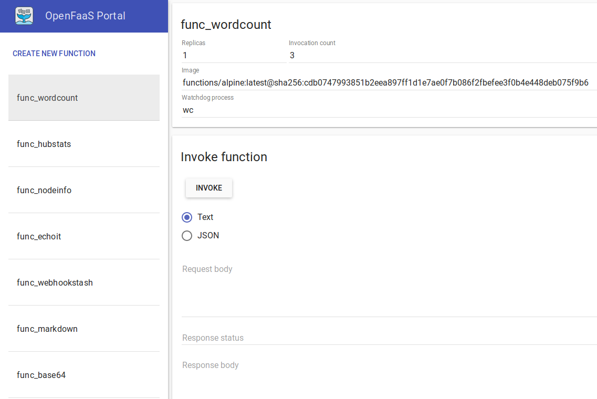

## Vorraussetzungen
Für dieses Tutorial empfehlen wir die Poolrechner mit Linux zu verwenden. Auf diesen Rechner ist bereits alle notwendige Software und der richtigen Version vorinstalliert.

Es ist ebenfalls möglich das Tutorial auf dem eigenen Rechner durchzuführen.
Dafür gibt es folgende Vorraussetzungen an Software, die installiert sein muss:
- Docker >= 17.04
- Docker Compose >= 1.13

## OpenFaaS Einleitung

## Aufgabe 1: Setup
Als erster Schritt muss eine lokale OpenFaaS Instanz vor allen weiteren Schritten gestartet werden. Dafür müssen folgende Schritte ausgeführt werden:

1. Ein Terminal öffnen und in ein Verzeichnis navigieren z.b.

    `cd ~/Downloads`
2. OpenFaaS Repository klonen

    `git clone https://github.com/openfaas/faas`
3. In das erstelle Verzeichnis navigieren

     `cd faas`
4. Richtige Version in Git auschecken

    `git checkout 0.6.8`
4. Docker Swarm initialisieren

    `docker swarm init`
5. OpenFaaS Start Script ausführen

    `./deploy_stack.sh`

Wenn das OpenFaaS Setup erfolgreich gestartet wurde lässt sich nun [http://localhost:8080](http://localhost:8080) im Browser öffnen. Auf mehr Details in dem Webinterface soll in der nächsten Aufgabe eingegangen werden.

## Aufgabe 2: Funktionen ausführen
Nachdem in Aufgabe 1 eine lokale OpenFaaS Instanz gestartet wurde sollen in dieser Aufgabe nun erste Funktionen ausgeführt werden.

### Webinterface
Der einfachste Weg Funktionen in OpenFaaS auszuführen ist über das Webinterface auf [http://localhost:8080](http://localhost:8080) im Browser.



Als erstes soll nun die Funktion `func_wordcount` ausgeführt werden. Die Funktion liefert die Anzahl an Zeilenumbrüchen, Wörtern und Zeichen für den Text im Request Body zurück. Zunächst muss etwas als Inhalt im Request Body im Webinterface angegeben werden. Anschließend ruft ein Klick auf "Invoke" die Funktion auf und gibt den Response Body, sowie einen HTTP Status Code zurück. Ebenfalls können weitere Funktionen wie `func_markdown` ausgeführt werden, die Markdown in HTML konvertiert.

### API
Das Webinterface eignet sich sehr gut, um sich Funktionen anzeigen zu lassen und zu testen, was die Eingabe und Ausgabe ist. Für komplexerer Funktionen oder den praktischen Einsatz in Kombination mit anderen Systemen ist jedoch die REST API von OpenFaaS sehr viel nützlicher.

Funktionen können in OpenFaaS durch einen HTTP POST Request aufgerufen werden. Die URL für den Request setzt sich aus dem Host auf dem OpenFaaS läuft, dem Port und dem Funktionsnamen zusammen. Eine URL könnte Beispielsweise folgendermaßen aussehen:

    http://localhost:8080/function/hello-world

POST Request können in cURL mit folgendem Befehl geschickt werden:

    curl -X POST <URL>

Nun sollt ihr die Funktion `func_nodeinfo` mit einem cURL ausführen, die Informationen zum System zurückliefert. Wenn alles erfolgreich funktioniert hat wird cURL das Betriebssystem, Anzahl der verfügbaren CPU Kernen und Laufzeit des System zurückliefern.

Auch über cURL lassen sich Daten mit im Request Body übergeben, die für Funktionen benötigt werden. Hierfür soll nun die die Funktion `func_wordcount` ausgeführt werden. Daten im Request Body lassen sich in cURL folgendermaßen übergeben:

    curl -X POST <URL> -d "content"

Wenn dieser Funktion ausgeführt wird nun die Anzahl der Wörter zurückgeliefert.


## Aufgabe 3: Funktionen erstellen
In dem nächsten Schritt sollen nicht mehr länger nur bestehende Funktionen ausgeführt werden, sondern die erste eigene Serverless Function in Java geschrieben werden.

### OpenFaaS CLI
Es ist möglich OpenFaaS komplett über die REST API zu steuern. Einige Aufgaben werden durch den Kommandozeilen Client jedoch deutlich erleichtert. Beispielsweise das Hochladen neuer Funktionen. Deshalb soll im nächsten Schritt der OpenFaaS CLI client installiert werden. Dafür muss folgender Befehl im Terminal ausgeführt werden:

    curl -sSL https://cli.openfaas.com | sh

*Don't try this at home*

### Hello World
In dieser Aufgabe soll endlich die erste eigene Serverless Function programmiert werden. Die Grundlagen für das ausführen dieser Funktion befinden sich bereits auf [Github](https://github.com/theSoenke/serverless-tutorial/tree/master/tutorial-3). Das Dockerfile und die Datei stack.yml sind bereits vorgebenen und können direkt in ein neues lokales Verzeichnis ohne weitere Anpassungen kopiert werden.

Die Funktion soll in diesem Beispiel in Java programmiert werden. Theorethisch lässt sich die Programmiersprache jedoch frei wählen, solange das Programm in einem Docker Container ausführbar ist. Als erster Schritt muss in dem neu erstelltem Verzeichnis mit den beiden Dateien `Dockerfile` und `stack.yml` eine dritte Datei `Handler.java` erstellt werden. Diese Datei soll die öffentliche Klasse Handler enthalten, sowie die Java main Methode.

Nun geht es daran die Logik der Serverless Function zu implementieren. In diesem Fall soll es sich noch um eine Hello World Anwendung handeln also kann die main Methode beispielsweise "Hello World" in der main Methode ausgeben.

```java
System.out.print("Hello World");
```

Damit ist bereits die erste Serverless Function komplett. Nun muss noch ein Docker Container gebaut werden. Ein Docker Container ist hier der Weg, um die Anwendung zu verpacken und plattformunabhängig auszuführen, da der Docker Container alle Abhängigkeiten enthält.

    faas-cli build -f stack.yml

Wenn das Bauen des Containers erfolgreich war kann dieser nun als Funktion in OpenFaaS deployed werden.

    faas-cli deploy -f stack.yml

Wenn jetzt wieder da [Webinterface](http://localhost:8080) geöffnet wird sollte nun eine zusätzliche Funktion `hello-world` angezeigt werden. Ein Klick auf "Invoke" wird nun "Hello World" zurückgeben.

## Aufgabe 4: Multimedia
In den bisherigen Aufgaben waren die Ein- und Ausgaben der FaaS Funktionen ausschließlich Text. In dieser Aufgabe soll gezeigt werden, dass sich Serverless auch für Multimedia Aufgaben Einsatz finden kann.

### Memes Service
In dieser Aufgabe soll ein Service für Memes erstellt werden. Der Nutzer gibt 2 Beschriftungen für, sowie eine URL zu seinem Lieblingsmeme Hintergrundbild an. Anschließend liefert die Funktion ein fertiges Meme aus den Beschriftungen und dem Bild.

Als erster Schritt muss eine Funktion deployed werden, die in der Lage ist Memes aus dem Input zu generieren.

    faas-cli deploy --image developius/faas-mememachine --name meme-generator

Damit ist der Meme Service bereits lauffähig und kann Memes generieren. Dies kann ebenfalls über cURL geschehen. Die Ausgabe von cURL wird anschließend in eine Datei geschrieben.

    curl -X POST http://localhost:8080/function/meme-generator -d '{"image": "http://vignette4.wikia.nocookie.net/factpile/images/6/66/Lotr-boromir-1280jpg-b6a4d5_1280w.jpg","top": "ONE DOES NOT SIMPLY JUST","bottom": "DEPLOY TO PRODUCTION"}' > meme.jpg

### Youtube Downloader
Neben Bilder ist es auch möglich Videos über eine FaaS Funktion herunterzuladen. Im nächsten Beispiel kann eine Youtube URL übergeben werden und die Funktion liefert das heruntergeladene Video zurück.

    faas-cli deploy --image alexellis2/faas-youtubedl --name youtubedl

Dann muss nur noch die Funktion mit einem Video aufgerufen werden:

    curl http://localhost:8080/function/youtubedl -d "https://www.youtube.com/watch?v=nG2rNBFzkGE" > cat_jump.mov

Wenn der Download erfolgreich war sollte sich die Datei cat_jump.mov in einem Videoplayer öffnen lassen.

## Aufgabe 5: Skalieren und Überwachen
Ein Vorteil von Serverless Functions ist das automatische Skalieren bei einem Anstieg der Last. Somit wird das Multithreading automtaisch vom FaaS übernommen. Die Skalierung funktioniert sogar besser als bei einem Multithreading auf einem Host, da die Funktionen über mehrere Hosts verteilt werden können, wenn das System entsprechend konfiguriert ist. In dieser Aufgabe soll es eine Einführung zum Autoscaling von Serverless Functions und der Überwachung der Systemlast geben.

### Skalieren

Damit Last auf dem System erzeugt wird können Funktionen auf dem System in einer Schleife aufgerufen werden. Folgender Befehl wird die Funktion `func_nodeinfo` in einer While-Schleife immer wieder aufrufen und das Ergebnis der Funktion im Terminal ausgeben.

    while [ true ] ; do curl -X POST http://localhost:8080/function/func_nodeinfo -d ''; done

Das Ergebnis einer Funktionsausführung wird in etwa so aussehen:

    Platform: linux
    Arch: x64
    CPU count: 1
    Uptime: 45796
    Hostname: ecf68e8034b8

Bei einer ausreichend großen Last auf dem System wird ein Serverless System automatisch skalieren und neue Instanzen starten, damit Request parallel verarbeitet werden können. In dem Fall von OpenFaaS bedeutet dies, dass neue Docker Container gestartet werden. Damit sollte sich in der Ausgabe nach einer gewissen Zeit neue Hostnamen von neuen Instanzen erscheinen. Dieses skalieren ist bei einem Setup in einem Cluster von Rechner nicht nur lokal möglich, sondern kann über dutzende bis hunderte von Rechnner erfolgen.

### Überwachen
Für das Überwachen eines Serverless Systems gibt es verschiedene Lösungen. Populär ist in diesem Bereich beispielsweise die von Soundcloud entwickelte Open Source Lösung [Prometheus](https://prometheus.io). OpenFaaS hat bereits ein Monitoring mit Prometheus integriert. Dafür muss [localhost:9090](http://localhost:9090) im Browser geöffnet werden.